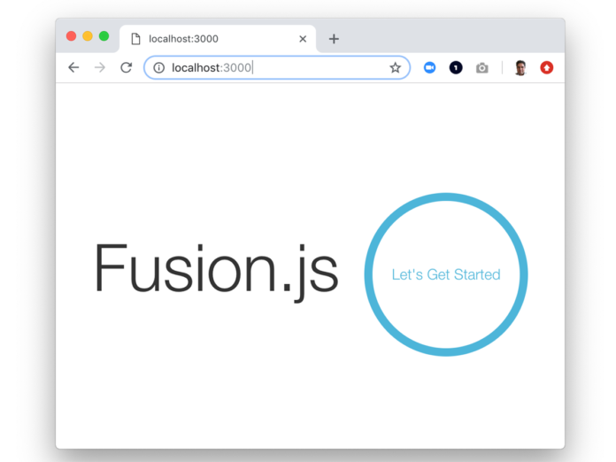
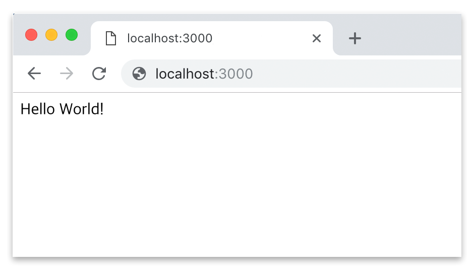

# Getting started

Fusion.js is designed to make web development easier and produce lightweight, high-performing apps. It is used extensively within [Uber](https://eng.uber.com/fusionjs/) and powers many high trafficked websites.

In this tutorial, we walkthrough how to get started with Fusion.js and have a 'Hello World!' application up and running in 5 minutes. The tutorial walks through three easy steps, from creating the application to displaying 'Hello World!' in the browser. The 'Hello World!' application is a good starting point for those seeking to get deeper into the Fusion.js framework.

---

### Step 1: Create a boilerplate app

Creating a Fusion.js application is easy. In this tutorial, we will use [Yarn](https://code.fb.com/web/yarn-a-new-package-manager-for-javascript/), an open source package manager created at Facebook, to set up the Fusion.js scaffold for our application. Yarn replaces the existing workflow with the npm client or another package manager while remaining compatible with the npm registry. It has the same feature set as existing workflows while operating faster, more securely, and more reliably.

**Note**: If you have already completed this step, please skip to *Step 2: Run your app*.

In your terminal, run the following `yarn` command to create a boilerplate app, `hello-world-app`:

```sh
yarn create fusion-app hello-world-app
```

The command will create a new directory, `hello-world-app`, that contains all the files needed to set up and run Fusion.js. When Yarn finishes successfully, the terminal will display the message "Success! You have created a Fusion.js project". Now go to the newly-created source directory of `hello-world-app`.

```sh
cd hello-world-app/src
```

Run `ls` to view the file structure of `hello-world-app`.

```sh
.
├── pages
│   ├── home.js
│   └── pageNotFound.js
├── main.js
└── root.js
```

The directory pages contains the [React](https://reactjs.org/) code for rendering the demo page and the "Page not found" page. The file `main.js` is the application's entrypoint, and `root.js` contains routes.

---

### Step 2: Run your app

You are now ready to start the application you created in Step 1. In your terminal, run the following `yarn` command in the project’s root directory:

```sh
yarn dev
```

This serves up the Fusion.js demo page, as shown below, on http://localhost:3000.



---

### Step 3: Say 'Hello World!'

In the final step of this tutorial, you will rewrite the default Fusion.js demo page to make it say 'Hello World!'. To simplify this step, you must replace the demo code in the existing `home.js` file with new code that can render the 'Hello World!' text in your browser. This means the routes will remain the same and no other code changes are required.

1. Open `home.js` and remove the existing code so the file is completely empty.
2. Copy and paste the code snippet below to `home.js`. This snippet imports the React libraries used to render the 'Hello World!' text in your browser.

```js
// src/pages/home.js

import React from ‘react’;

const Home = () => (

);

export default Home;
```

3. Add 'Hello World!' text between `<div>` tags.

```js
// src/pages/home.js

import React from ‘react’;

const Home = () => (
 <div>Hello World!</div>
);

export default Home;
```

4. Hot module reloading ensures your changes will be reflected in real time if your server is still running. In your browser, you should now see your app's home page displaying 'Hello World!'

<ol style="list-style-type: none">If you don't see them, you have probably stopped the server. Re-run `yarn dev` to rerun your application. As soon the server starts again, access your file by visiting http://localhost:3000. The message `Build completed in x.xxxs` will be shown in the terminal when the server has restarted.</ol>



**Great job!** You've just learned how to create a simple application with Fusion.js!

---

### Example applications

We have a list of Fusion.js example applications on the [Create a project](/docs/getting-started/create-a-project/#example-fusionjs-projects) page.

### Create a new web application

When you're ready to start on a new web project, run through these steps:

- [Create a project](/docs/getting-started/create-a-project)
- [Run your project](/docs/getting-started/run-your-project)

---

### Next steps

Here are some more in-depth sections covering various aspects of Fusion.js:

#### Core concepts

- [Universal rendering](/docs/references/universal-rendering)
- [Creating a plugin](/docs/references/creating-a-plugin)
  - [Tokens](/docs/references/creating-a-plugin/tokens)
  - [Dependencies](/docs/references/creating-a-plugin/dependencies)
  - [Creating endpoints](/docs/references/creating-a-plugin/creating-endpoints)
  - [Creating providers](/docs/references/creating-a-plugin/creating-providers)
  - [Modifying the HTML template](/docs/references/creating-a-plugin/modifying-html-template)

#### Plugins

Check out the links below to help you get familiar with other useful plugins that are provided by the Fusion.js team:

- [Styletron](https://github.com/fusionjs/fusion-plugin-styletron-react)
- [React Router](https://github.com/fusionjs/fusion-plugin-react-router)
- [RPC/Redux](https://github.com/fusionjs/fusion-plugin-rpc-redux-react)
- [I18n](https://github.com/fusionjs/fusion-plugin-i18n-react)
- [Error handling](https://github.com/fusionjs/fusion-plugin-error-handling)
- [Logging](https://github.com/fusionjs/fusion-plugin-universal-logger)
