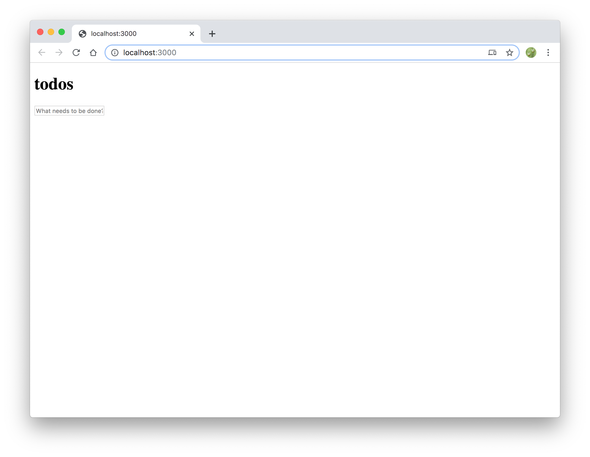
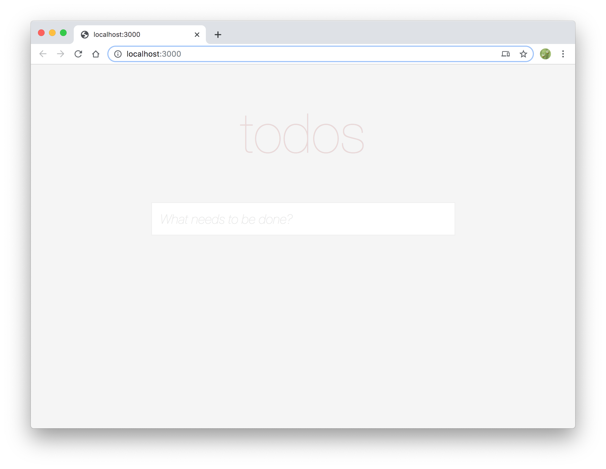

# Building the UI

In this section, we'll add the main UI for the to-do app.

We won't focus too much on optimizing our component tree as the focus of this tutorial isn't on the React portion so we'll stick to just putting everything into a single component to keep things simple.

## UI Code

Create a new file at the following path: `src/components/root.js` (you'll need to create the `components` folder).

Paste the following into it:

```js
import React, {useState} from 'react';

const Root = () => {
  const [todos, setTodos] = useState([]);
  const [inputText, setInputText] = useState('');

  const handleOnKeydown = (e) => {
    if (e.key === 'Enter') {
      setInputText('');
      setTodos([
        ...todos,
        inputText
      ]);
    }
  };

  const handleOnChange = (e) => {
    setInputText(e.currentTarget.value);
  };

  return (
    <React.Fragment>
      <h1>todos</h1>
      <div className="container">
        <input
          onChange={handleOnChange}
          onKeyDown={handleOnKeydown}
          placeholder="What needs to be done?"
          value={inputText}
          type="text"
        />
        {todos.map(todo => (
          <div className="todo">
            <div className="todo-text">{todo}</div>
          </div>
        ))}
      </div>
    </React.Fragment>
  );
}

export default <Root />;
```

This lays the groundwork for our component that will be able to display and add to-dos. **Note that Fusion.js expects the root level component to be a React element, _NOT_ a React component.**

We'll need to update our entry point file at `src/main.js` to use this new component.

```js{2,5}
import App from 'fusion-react';
import Root from './components/root';

export default async function start() {
  const app = new App(Root);
  return app;
}
```

Now, reload your page and you should see the components rendered.



## Explanation

Before we move on, take a minute to look at the code and familiarize yourself with it.

* We've set up some internal state using hooks: one for the contents of the input box, one for the actual to-do items.
* We map over the to-do items to generate the list.
* We Render the `<input>` box and attach some event handlers to it to listen for the Enter key as well as make the input a [controlled component](https://reactjs.org/docs/forms.html#controlled-components).
* If the user hits Enter on the `<input>` box, call the `setTodos` hook function to write the new to-do item into our array.

## Options for persistance

Obviously, we could call this current implementation done but given that the state will be lost on a refresh, we can do better here. While using something like `localStorage` would work to save the data between page refreshes, let's persist this data on the server instead so that on subsequent reloads (no matter which client we use), our to-do list data will be retrieved on page load.

In order to do this, we'll need to build some Fusion.js plugins to accomplish this. We'll dive into this in the [next section](/docs/learning-fusionjs-tutorial/loading-data).

---

## Optional Styling

While styling is not the focus of this exercise, it can definitely make even the most basic example pop. A quick way to add styling would be to leverage React Helmet to add a `<style>` tag and define some CSS to match the ones from [TodoMVC](http://todomvc.com/examples/react/#/).

This does require adding some additional registration code. Later parts of this tutorial will showcase screenshots that use this styling but this is completely optional and does not affect the functionality of the app in any way.

To start, add the `fusion-plugin-react-helmet-async` plugin to your project:

```sh
$ yarn add fusion-plugin-react-helmet-async
```

Then register that plugin in `src/main.js`:

```js{3,7}
import App from 'fusion-react';
import Root from './components/root';
import HelmetPlugin from 'fusion-plugin-react-helmet-async';

export default async function start() {
  const app = new App(Root);
  app.register(HelmetPlugin);
  return app;
}
```

Add the import to the top of `src/components/root.js`:

```js
import {Helmet} from 'fusion-plugin-react-helmet-async';
```

Then add the following styles in a `<Helmet>` tag to `src/components/root.js` (after the opening `<React.Fragment>` tag):

```js
return (
  <React.Fragment>
    <Helmet>
      <style>
      {`
        body {
          background-color: #f5f5f5;
          font: 24px 'Helvetica Neue', Helvetica, Arial, sans-serif;
        }
        h1 {
          color: rgba(175, 47, 47, 0.15);
          font-size: 100px;
          font-weight: 100;
          text-align: center;
        }
        .container {
          background: #ffffff;
          border: 1px solid #ededed;
          margin: 0 auto;
          width: 550px;
        }
        input {
          border: none;
          font-size: 24px;
          font-weight: 300;
          padding: 15px;
          width: 520px;
        }
        input::placeholder {
          color: #e6e6e6;
          font-style: italic;
          font-weight: 100;
        }
        .todo {
          border-top: 1px solid #ededed;
          padding: 15px;
        }
        .todo-text {
          font-weight: 300;
        }
      `}
      </style>
    </Helmet>
    <h1>todos</h1>
    /* Rest of code */
  </React.Fragment>
);
```

Refresh and you'll see the styling applied.


