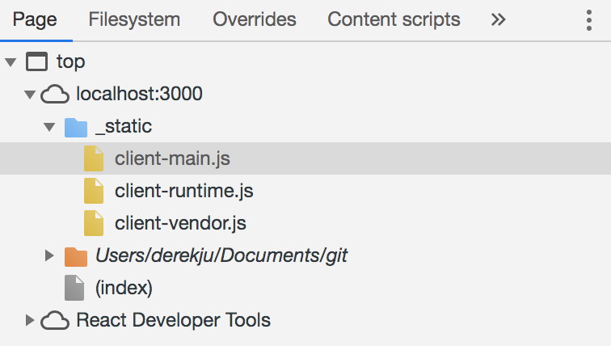

# Learning Fusion.js Tutorial

This tutorial will cover building a Fusion.js app from scratch. We will be walking through step-by-step how to build a simple app that fetches data from X and displays Y.

It will be helpful to read through the [Core Concepts](/docs/core-concepts) of Fusion.js before running through this tutorial but it is not required as we will explain as we go along. Some basic understanding of making HTTP requests/responses and familiarity with React are also recommended.

### Prerequisites

[Insert Here]

## Installation

To begin, we'll need to create a new project and install the core Fusion.js framework. Fusion.js, at a minimum, is composed of three separate packages, each dedicated to a different part of the framework:

1. `fusion-core` is the core library, responsible for plugin registration, and handling the request lifecycle of a Fusion.js app.
2. `fusion-react` extends `fusion-core` and replaces the internal rendering engine with React. Both client and server side rendering logic are included.
3. `fusion-cli` is a set of command line tools that compile all source code as well as starts the Node server that runs a Fusion.js app

These are explained in [Core Packages](/docs/core-concepts/core-packages).

For now, let's just setup and install all of the packages in our new project. We'll need to install a few extra packages beyond the core libraries as peer dependencies (`fusion-tokens`, `react`, and `react-dom`).

```sh
$ mkdir fusion-twitter
$ cd fusion-twitter
$ yarn init
$ yarn add fusion-core fusion-react fusion-cli fusion-tokens react react-dom
```

## Initializing the app

Let's add some code to instantiate our Fusion.js app. Create a new folder named `src` and a new file named `main.js` and add the following code to it.

```js
// src/main.js

import App from 'fusion-react';
import React from 'react';

export default async function start() {
  const root = <div>Hello World</div>
  const app = new App(root);
  return app;
}
```

> **NOTE:** The Fusion.js compiler expects all application source code to be placed in the `src/` directory and specifically the main entrypoint to be located at `src/main.js`. There are Fusion.js-specific tranformations the compiler will apply to files in `src/` but not files outside (e.g. `node_modules`, etc).

That's all we need to get started. To run our code, we'll use helper scripts installed from `fusion-cli`. Add the following script to your `package.json` file.

```json
{
  "scripts": {
    "dev": "fusion dev"
  }
}
```

Then, run `yarn dev` to start the Fusion.js server. After the code compiles, you will see "Hello World" rendered on the page in plain text.

[Insert image here]

7 lines of code was all it took to start rendering content onto our page! Let's take a closer look at the code that we just wrote. While it doesn't do much currently, it sets up the foundation that we will build on and also introduces some important points about Fusion.js:

* `App` is an instance of the [`FusionApp`](/api/fusion-core#app) class exported from `fusion-react`. The `FusionApp` class is responsible for both client and server side rendering as well as handling requests. The functionality can also be extended via plugins that we will learn about later.
* When `fusion dev` is invoked, it compiles your code, spins up a Node server, and proxies all requests to `FusionApp`. This explains why the entrypoint file at `src/main.js` only returns an instance of `FusionApp` and does nothing else related to creating an HTTP server. (Essentially, the actual Node server is obfuscated behind `fusion-cli`.)

### Hot Module Reloading (HMR)

Try making changes to your source file, such as changing the text from "Hello World" to "Goodbye". You'll notice that the developer tooling provided by `fusion-cli` has been setup with hot module reloading out of the box.

### Bundle Splitting

If you inspect the page resources using Chrome dev tools, you'll see three separate scripts were downloaded:



Behind the scenes, `fusion-cli` intelligently handles how to bundle split your application so that you don't have to worry about tweaking Webpack configurations manually by hand.

## Next Steps

In the [next section](/docs/learning-fusionjs-tutorial/plugins), we'll begin building our site by making basic API calls to display data. In doing so, we'll dig into the building blocks of Fusion.js sites - plugins.
