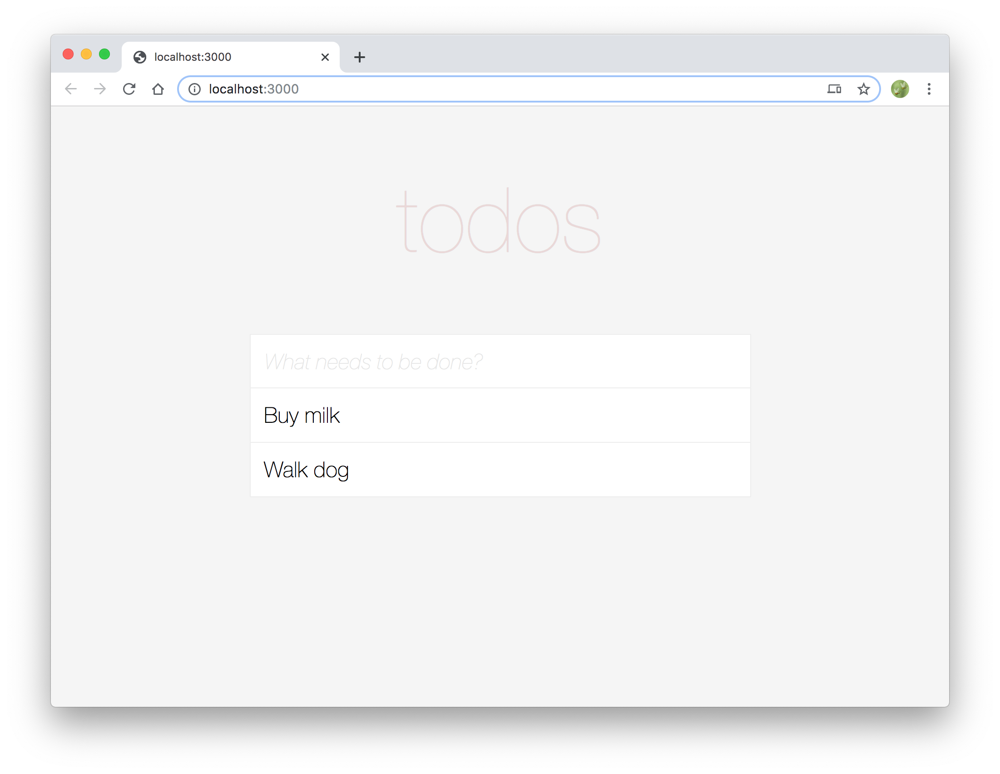

# Loading Data

In this section, we will add the ability to load to-do items. We'll accomplish this by:

* Making a call in our component layer to fetch data
* Adding a handler on the server side to load data

Let's begin!

## Making a call in our component layer to fetch data

We'll add a call into our component inside a `useEffect()` block that will make the call. Before that, we'll want to make sure we use a `fetch` library that works on the server as well as the client so let's install `isomorphic-fetch`.

```sh
$ yarn add isomorphic-fetch
```

> **Why not just use `window.fetch`?**
> Remember that Fusion.js is universal so your component is rendered on both the client and the server. Because `window` does not exist on the server, you generally need to ensure that whatever libraries you use inside of your components work on the server as well.

Add the import statement to the top of `src/components/root.js`:

```js
import fetch from 'isomorphic-fetch';
```

Make sure to import `useEffect`:

```js{1}
import React, {useState, useEffect} from 'react';
```

And add the following code inside of a `useEffect()` block inside of the component:

```js{5-12}

const Root = () => {
  const [todos, setTodos] = useState([]);
  const [inputText, setInputText] = useState('');

  useEffect(() => {
    fetch('/api/todos')
      .then(async res => await res.json())
      .then(res => setTodos(res));
  }, []);
```

That's it. We add a call on component mount to fetch our data and then update our component state with that data. Let's move on to the server handler so that the fetch works.

## Adding a handler on the server side to load data

In [Core Concepts](/docs/core-concepts/plugins), we learned that Fusion.js plugins can be used to read request headers/data and to modify the request body. We'll be utilizing this functionality to build our endpoint.

> **NOTE**: Under the hood, Fusion.js is leverage Koa for reading request data and writing out to the response stream. For more details, view the [Koa docs](https://github.com/koajs/koa).

Let's create a new middleware function at `src/plugins/todos.js`:

```js
const todos = ['Buy milk', 'Walk dog'];

export default async (ctx, next) => {
  if (ctx.path === '/api/todos') {
    if (ctx.method === 'GET') {
      ctx.response.body = todos;
    }
  }
  await next();
};
```

Here, we've defined a short-hand for declaring Fusion.js plugin middlewares. Instead of using the full `createPlugin` syntax that allows for declaring dependencies and services, we are only going to define middleware. The middleware receives two arguments:

* `ctx` contains request and response related information. For the full list of supported properties, see the [API docs](/api/fusion-core#context).
* `next` is a required method that is called to execute downstream middleware. For more details, see the [Koa docs](https://github.com/koajs/koa#middleware).

Here, we are checking the `path` and `method` to mount an endpoint at the `/api/todos` path for `GET` requests. If the properties match, then we modify the `response.body` property and send the list of todos down.

Now, we need to register this middleware with our app in `src/main.js`:

```js{3,7-9}
import App from 'fusion-react';
import Root from './components/root';
import TodosPlugin from './plugins/todos';

export default async function start() {
  const app = new App(Root);
  if (__NODE__) {
    app.middleware(TodosPlugin);
  }
  return app;
}
```

We use the `middleware` function on `app` to mount our middleware method. We also [code fence](/docs/core-concepts/universal-framework) this registration since we only want to mount endpoints on the server and not in the browser. Remember that this will optimize the browser bundle and not include this line of code in the bundle, thus reducing its size.

If you load your app now, you should see our default notes pre-loaded!



In the [next section](/docs/learning-fusionjs-tutorial/adding-data), we'll add functionalty to create new todo items.
